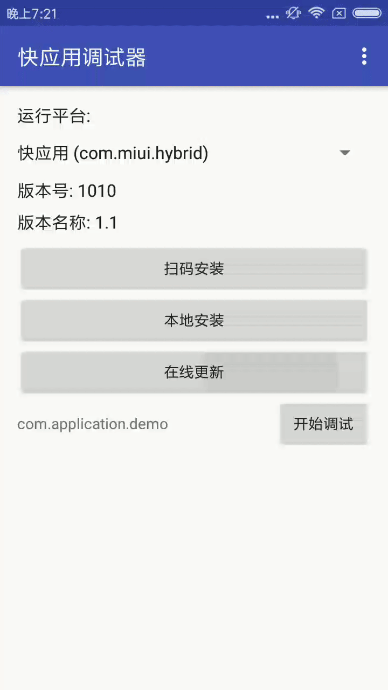

# QuickApp • TodoMVC

### 简介

快应用是基于手机硬件平台的新型应用形态，具备传统APP完整的应用体验，无需安装、即点即用

本项目是一个在快应用中实现TodoMVC应用的课程类示例，从零逐步构建一个完整的TodoMVC应用

### 课程

1. 组件篇：引入div、text、input
2. 样式篇：引入less，增加样式
3. 逻辑篇：引入for指令
4. 脚本篇：引入事件，增加交互
5. 接口篇：引入接口
6. 自定义组件篇：引入自定义组件，实现父子组件通信
7. 优化篇：引入list组件，复用同类型的list-item

### 效果预览

### 相关链接

[快应用官网](https://www.quickapp.cn/)

[快应用官网开发文档](https://doc.quickapp.cn/)